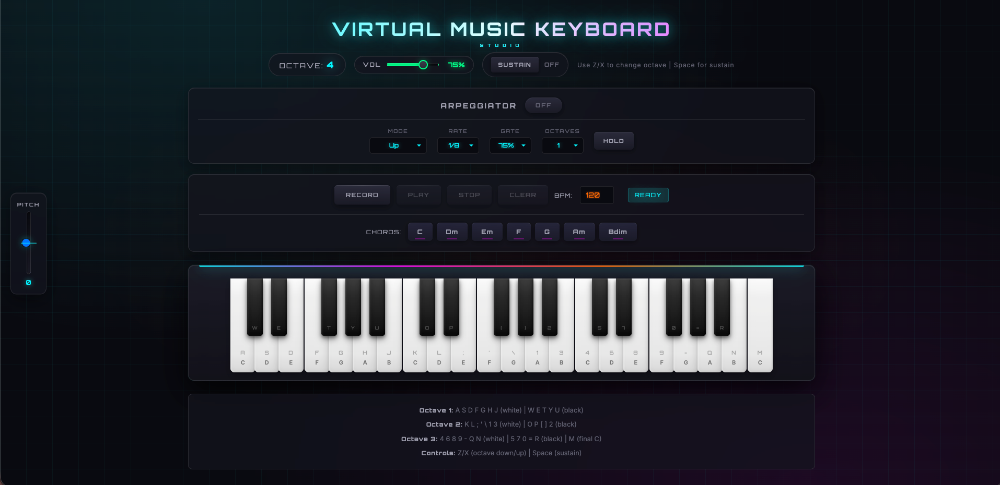

# 🎹 Virtual Music Keyboard

Um teclado musical virtual profissional direto no seu navegador — com visual estilo DAW, arpeggiator, sequencer e muito mais.



## ✨ Features

- **37 teclas** (3+ oitavas) com feedback visual
- **Arpeggiator** com modos Up, Down, Up/Down, Random e As Played
- **Pitch Bend Wheel** com ±2 semitons e retorno automático
- **Sustain Pedal** (Space ou botão na tela)
- **Loop Sequencer** para gravar e reproduzir sequências
- **Acordes de 1 clique** — C, Dm, Em, F, G, Am, Bdim
- **Visual DAW-style** com tema dark e neon (cyan/magenta/orange)
- **Controle de volume** master em tempo real
- **100% tocável pelo teclado** — todas as teclas mapeadas

## 🎮 Como Usar

1. Abra o `index.html` no navegador
2. Toque usando o teclado do computador ou clicando nas teclas
3. Use **Z/X** para mudar oitava
4. **Space** ativa o sustain
5. Grave loops com os botões Record/Play/Stop
6. Experimente o arpeggiator e o pitch bend!

### ⌨️ Mapeamento do Teclado

| Oitava | Teclas Brancas | Teclas Pretas |
|--------|----------------|---------------|
| 1 | A S D F G H J | W E T Y U |
| 2 | K L ; ' \ 1 3 | O P [ ] 2 |
| 3 | 4 6 8 9 - Q N | 5 7 0 = R |
| 4 | M (Dó final) | — |

## 🤖 Feito com Ralph

Este projeto foi construído usando o **Ralph Loop** — um método de desenvolvimento autônomo onde o Claude (AI) trabalha em ciclos:

```
Fail → Fix → Fail → Fix → Commit → Repeat
```

O Ralph lê um PRD (Product Requirements Document), executa tarefas, commita o progresso, e repete até completar. Zero ego, zero standups, só código.

**Scripts incluídos:**
- `gen-prd.sh` — Gera o PRD do projeto
- `ralph-once.sh` — Executa uma tarefa por vez
- `ralph-afk.sh` — Modo AFK, roda N tarefas enquanto você descansa


## 🛠️ Tech Stack

- **HTML5** + **CSS3** + **JavaScript**
- **Web Audio API** para síntese de som
- **Zero dependências** — só abre e usa

## 📁 Estrutura

```
├── index.html      # Estrutura principal
├── styles.css      # Visual DAW-style
├── script.js       # Lógica de áudio e eventos
├── PRD.md          # Documento de requisitos
└── progress.txt    # Diário do Ralph
```

## 🌐 Compatibilidade

- Chrome ✅ (recomendado)
- Firefox ✅
- Safari ✅
- Edge ✅

---

**Happy looping!** 🎉

## License

MIT License © 2026
